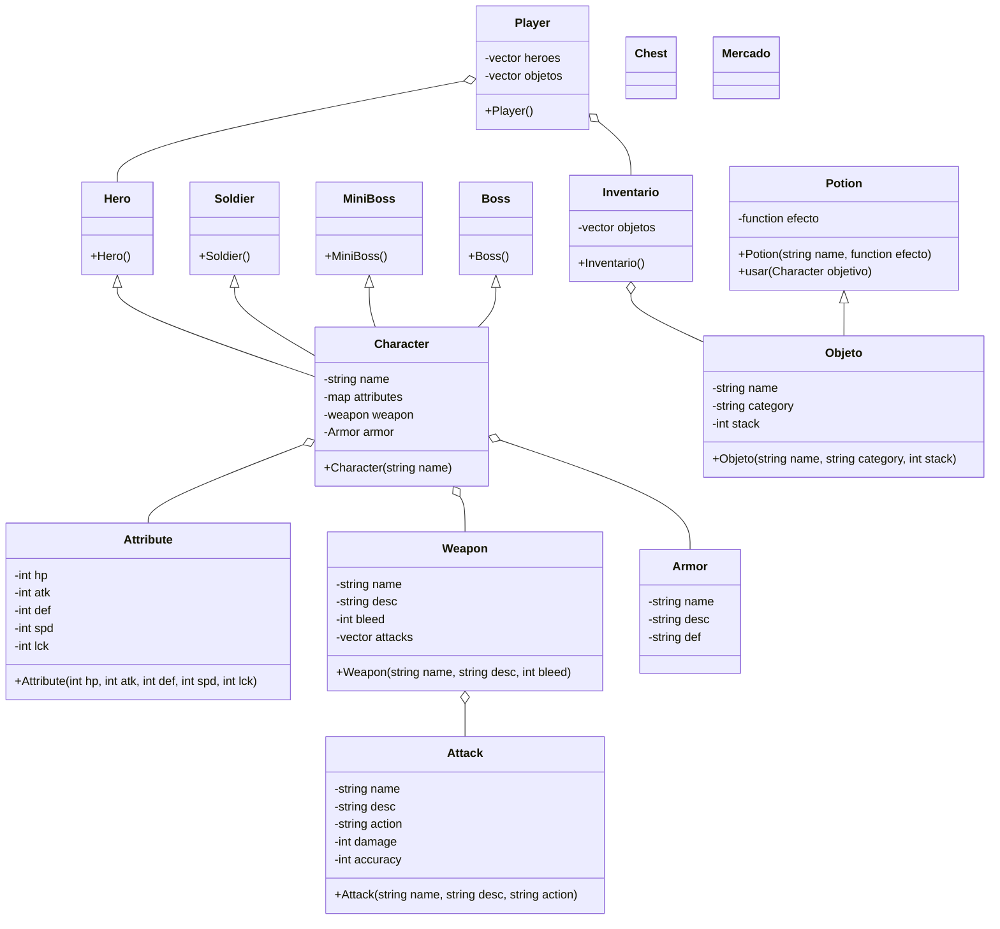

# Diagrama

```mermaid
classDiagram
    class Hero {
        +Hero()
    }

    class Soldier {
        +Soldier()
    }

    class MiniBoss {
        +MiniBoss()
    }

    class Boss {
        +Boss()
    }

    class Character {
        -string name
        -map<string, Attribute> attributes
        -weapon weapon
        -Armor armor
        +Character(string name)
    }

    class Attribute {
        -int hp
        -int atk
        -int def
        -int spd
        -int lck
        +Attribute(int hp, int atk, int def, int spd, int lck)
    }

    class Attack {
        -string name
        -string desc
        -string action
        -int damage
        -int accuracy
        +Attack(string name, string desc, string action)
    }

    class Weapon {
        -string name
        -string desc
        -int bleed
        -vector<Attack> attacks
        +Weapon(string name, string desc, int bleed)
    }

    class Player {
        -vector<Hero> heroes
        -vector<Objeto> objetos
        +Player()
    }

    class Objeto {
        -string name
        -string category
        -int stack
        +Objeto(string name, string category, int stack)
    }

    class Potion {
        -function efecto
        +Potion(string name, function efecto)
        +usar(Character objetivo)
    }

    class Chest {
        
    }

    class Mercado {
        
    }

    class Inventario {
        -vector<Objeto> objetos
        +Inventario()
    }

    class Armor {
        -string name
        -string desc
        -string def
    }

    
    Inventario o-- Objeto
    Potion <|-- Objeto    
    Player o-- Hero
    Player o-- Inventario
    Weapon o-- Attack
    Character o-- Weapon
    Character o-- Armor
    Hero <|-- Character
    Soldier <|-- Character
    MiniBoss <|-- Character
    Boss <|-- Character
    Character o-- Attribute
```
