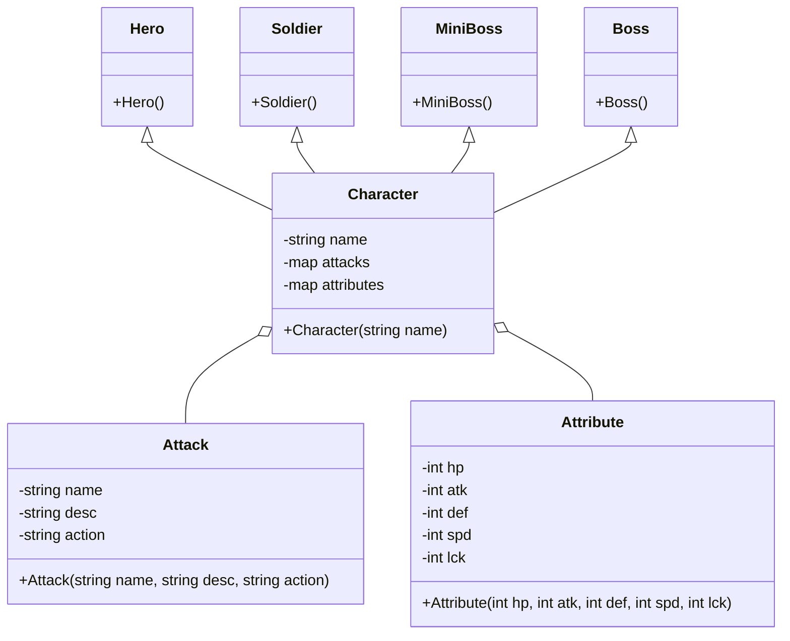

# Diagrama

```mermaid
classDiagram
    class Hero {
        +Hero()
    }

    class Soldier {
        +Soldier()
    }

    class MiniBoss {
        +MiniBoss()
    }

    class Boss {
        +Boss()
    }

    class Character {
        -string name
        -map<string, Attack> attacks
        -map<string, Attribute> attributes
        +Character(string name)
    }

    class Attribute {
        -int hp
        -int atk
        -int def
        -int spd
        -int lck
        +Attribute(int hp, int atk, int def, int spd, int lck)
    }

    class Attack {
        -string name
        -string desc
        -string action
        +Attack(string name, string desc, string action)
    }

    Hero <|-- Character
    Soldier <|-- Character
    MiniBoss <|-- Character
    Boss <|-- Character
    Character o-- Attack
    Character o-- Attribute
```
