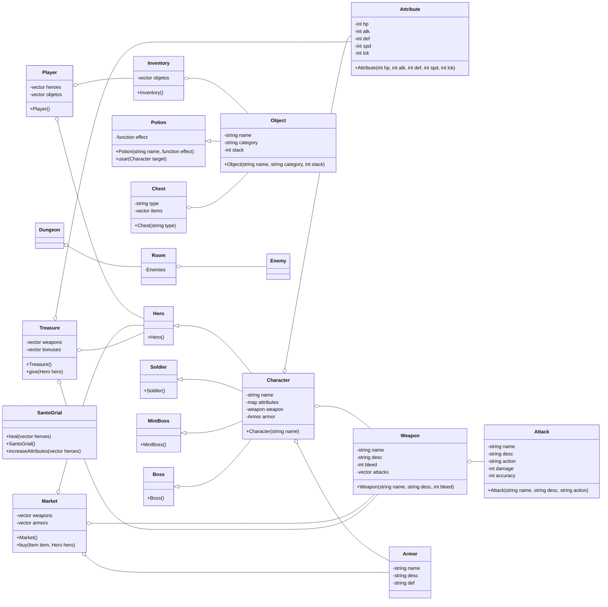

```mermaid
classDiagram
direction LR

    class Hero {
        +Hero()
    }

    class Soldier {
        +Soldier()
    }

    class MiniBoss {
        +MiniBoss()
    }

    class Boss {
        +Boss()
    }

    class Character {
        -string name
        -map<string, Attribute> attributes
        -weapon weapon
        -Armor armor
        +Character(string name)
    }

    class Attribute {
        -int hp
        -int atk
        -int def
        -int spd
        -int lck
        +Attribute(int hp, int atk, int def, int spd, int lck)
    }

    class Attack {
        -string name
        -string desc
        -string action
        -int damage
        -int accuracy
        +Attack(string name, string desc, string action)
    }

    class Weapon {
        -string name
        -string desc
        -int bleed
        -vector<Attack> attacks
        +Weapon(string name, string desc, int bleed)
    }

    class Player {
        -vector<Hero> heroes
        -vector<Object> objetos
        +Player()
    }

    class Object {
        -string name
        -string category
        -int stack
        +Object(string name, string category, int stack)
    }

    class Potion {
        -function effect
        +Potion(string name, function effect)
        +usar(Character target)
    }

    class Chest {
        -string type
        -vector<Object> items
        +Chest(string type)
    }

    class Market {
        -vector<Weapon> weapons
        -vector<Armor> armors
        +Market()
        +buy(Item item, Hero hero)
    }

    class Inventory {
        -vector<Object> objetos
        +Inventory()
    }

    class Armor {
        -string name
        -string desc
        -string def
    }

    class Treasure {
        -vector<Weapon> weapons
        -vector<Attribute> bonuses
        +Treasure()
        +give(Hero hero)
    }

    class SantoGrial {
        +heal(vector<Hero> heroes)
        +SantoGrial()
        +increaseAttributes(vector<Hero> heroes)
    }

    class Dungeon {

    }

    class Room {
        -Enemies
    }

    class Enemy {

    }

    Dungeon o-- Room
    Room o-- Enemy
    Inventory o-- Object
    Potion <|-- Object    
    Player o-- Hero
    Player o-- Inventory
    Weapon o-- Attack
    Character o-- Weapon
    Character o-- Armor
    Hero <|-- Character
    Soldier <|-- Character
    MiniBoss <|-- Character
    Boss <|-- Character
    Character o-- Attribute

    Market o-- Weapon
    Market o-- Armor
    Market o-- Hero
    Chest o-- Object
    Treasure o-- Weapon
    Treasure o-- Hero
    Treasure o-- Attribute
```
