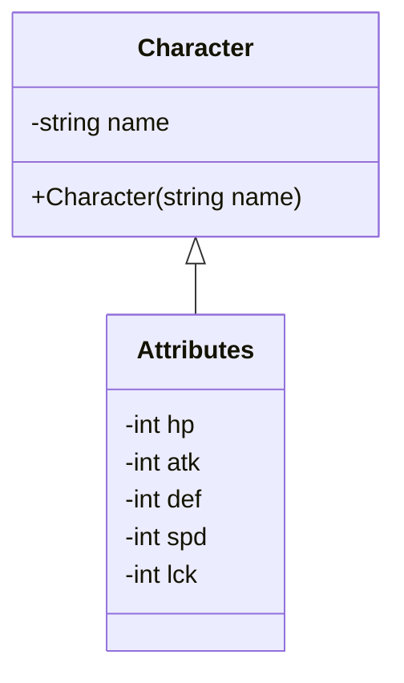

# Diagrama

```mermaid
classDiagram
    class Character {
        -string name
        +Character(string name)
    }

    class Attributes {
        -int hp
        -int atk
        -int def
        -int spd
        -int lck
    }

    Character <|-- Attributes
```
